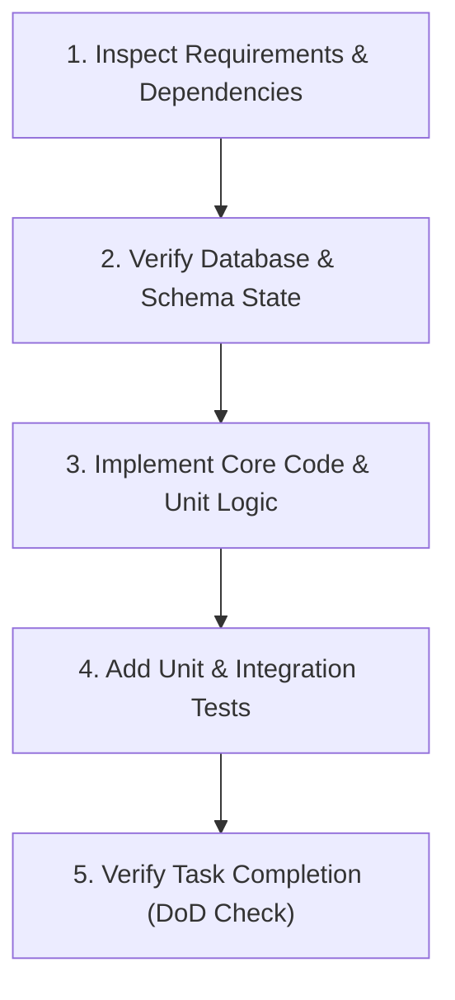

# Agent Execution Guidelines & Standard Operating Procedures (SOP)
## Multi-Tenant AI WhatsApp & Omnichannel Chatbot SaaS Platform

---

## 1. Role & Identity for Development Agents

You are acting as an expert Senior Full-Stack & AI Systems Engineer tasked with executing tasks from the master implementation plan. You must follow strict engineering standards, maintain multi-tenant data isolation, ensure zero hallucinations in AI tool invocation, and write production-grade, test-backed code.

---

## 2. Non-Negotiable Core Principles

### 2.1 Multi-Tenant Data Isolation
* **Rule 1:** Every query to the database MUST either use the PostgreSQL Row-Level Security (RLS) session context (`app.current_tenant_id`) or include an explicit `tenant_id` where clause.
* **Rule 2:** Redis cache keys MUST always be prefixed with the tenant ID:
  ```
  Format: tenant:{tenant_id}:{resource}:{id}
  Example: tenant:c4b8e2...:contact:38291
  ```
* **Rule 3:** Never expose tenant IDs in public URLs or client-facing responses unless it is within an authenticated workspace session.

### 2.2 Omnichannel Message Pipeline Integrity
* **Rule 1 (Asynchronous Webhook ACK):** Inbound webhooks from WhatsApp, Instagram, or WooCommerce MUST be acknowledged within **1,500ms** with `HTTP 200 OK`. Heavy processing (LLM calls, embeddings, database writes) MUST be pushed to BullMQ queues.
* **Rule 2 (Idempotency):** Every inbound webhook payload must check against Redis idempotency keys:
  ```
  Key: idempotency:msg:{channelMessageId}
  TTL: 300 seconds (5 minutes)
  ```
  If key exists, discard immediately to prevent duplicate replies during network retries.
* **Rule 3 (WhatsApp 24-Hour Rule):** Outbound messages to WhatsApp must check if the last inbound message from the user was within 24 hours. If > 24 hours, ONLY pre-approved Meta Templates may be sent.

### 2.3 AI Agent Tool Execution Safety
* **Rule 1 (Schema Validation):** All tool parameters passed by the LLM must be strictly validated using **Zod** schemas before executing any backend logic.
* **Rule 2 (Fail-Safe Handoff):** If a tool fails or throws an unhandled error, the agent must catch the error, inform the user politely, and set the conversation status to `HANDOFF_QUEUED` for a human agent.
* **Rule 3 (Prompt Injection & PII):** Customer inputs must be scrubbed of credit card numbers, national IDs, and raw SQL injection patterns before being formatted into the LLM context prompt.

---

## 3. Technology Stack & Coding Standards

### 3.1 Backend (Node.js & TypeScript)
* **Runtime:** Node.js >= 20 LTS (v22 installed on host).
* **Package Manager:** `npm` workspaces or standard `npm`.
* **Language:** TypeScript 5.x with strict mode enabled (`"strict": true`).
* **Formatting & Linting:** Prettier + ESLint with standard Airbnb or TypeScript-ESLint recommended rules.
* **Database Access:** Prisma ORM or Drizzle ORM with raw SQL fallback for high-performance `pgvector` hybrid search queries.
* **Queue Engine:** BullMQ with Redis connection pooling.

### 3.2 Frontend & Dashboards (Next.js)
* **Framework:** Next.js 14+ (App Router).
* **Styling:** Tailwind CSS + Shadcn UI (Radix UI primitives).
* **State Management:** Zustand for global UI state, TanStack Query (React Query) for server-state caching.
* **Icons:** Lucide React (`lucide-react`).

### 3.3 Embeddable Web Chat Widget
* **Zero Dependencies:** Written in TypeScript, compiled to a single vanilla JavaScript bundle (`bundle.js` < 40KB gzipped).
* **Isolation:** Wrapped in a Shadow DOM or CSS-isolated namespace to prevent host website style bleed.

---

## 4. Step-by-Step Agent Workflow for Implementing a Task

When executing any task from `PHASE_ROADMAP_TASKS.md`, follow this exact 5-step loop:



1. **Inspect Requirements & Dependencies:**
   * Read the task in [PHASE_ROADMAP_TASKS.md](file:///c:/Users/Administrator/Desktop/chat%20bot%20agent/PHASE_ROADMAP_TASKS.md).
   * Verify corresponding TypeScript interfaces in [API_CONTRACTS.md](file:///c:/Users/Administrator/Desktop/chat%20bot%20agent/API_CONTRACTS.md).
2. **Verify Database & Schema State:**
   * Ensure necessary migrations have been executed.
   * Verify RLS policies are applied for any new tables.
3. **Implement Core Code & Unit Logic:**
   * Write clean, self-documenting TypeScript code.
   * Add proper error handling, logging (using Pino or Winston with structured JSON logs), and tenant context propagation.
4. **Add Unit & Integration Tests:**
   * Write tests using Jest / Vitest.
   * Mock external APIs (OpenAI, Meta WhatsApp, WooCommerce, Stripe) during unit tests.
5. **Verify Task Completion (DoD Check):**
   * Run type check: `npm run type-check`.
   * Run tests: `npm test`.
   * Mark the task as `[x]` in `PHASE_ROADMAP_TASKS.md`.

---

## 5. Mocking & Local Development Guidance

Since local environments may not immediately have live Meta WhatsApp or Stripe webhooks configured:
* Always provide a **Mock Channel Simulator** endpoint:
  `POST /api/v1/mock/webhook/inbound` allowing the development team to simulate incoming WhatsApp messages, buttons, and media payloads.
* Store local seed data in `packages/database/prisma/seed.ts` with 2 distinct tenants, sample products, sample appointments, and sample knowledge chunks to immediately verify tenant isolation.

---

## 6. Error Codes & Standard HTTP Response Structure

All REST API endpoints must conform to this standard JSON payload structure:

### Success Response:
```json
{
  "success": true,
  "data": { ... },
  "meta": {
    "timestamp": "2026-10-01T12:00:00.000Z",
    "requestId": "req_8f1b2..."
  }
}
```

### Error Response:
```json
{
  "success": false,
  "error": {
    "code": "TENANT_QUOTA_EXCEEDED",
    "message": "Monthly conversation allowance has been reached for this workspace.",
    "details": {
      "limit": 1000,
      "used": 1000,
      "upgradeUrl": "https://app.saas.com/billing"
    }
  },
  "meta": {
    "timestamp": "2026-10-01T12:00:00.000Z",
    "requestId": "req_8f1b2..."
  }
}
```

---

## 7. Quality Gate Checklist (Definition of Done)
Before marking any phase or task as finished, the implementing agent must verify:
- [ ] No hardcoded secrets, API tokens, or encryption keys in code files.
- [ ] Every database model containing user/customer data includes a foreign key to `tenants(id)`.
- [ ] All async queue handlers have retry configurations with exponential backoff and dead-letter queues (DLQ).
- [ ] All external network calls (OpenAI, Meta, WooCommerce) specify explicit HTTP timeouts (default 10s).
- [ ] Clean type-check passes with 0 TypeScript compiler errors.
