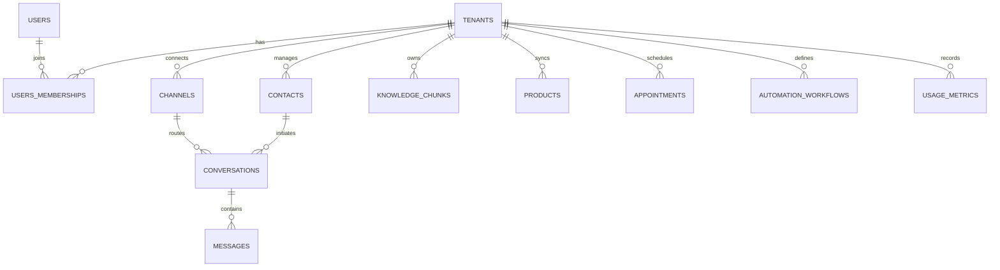

# Complete System Data Contracts & API Specifications
## Multi-Tenant AI WhatsApp & Omnichannel Chatbot SaaS Platform

---

## 1. Relational Database Schema & Entities

The relational database is PostgreSQL 16 with the `pgvector` extension enabled. All tenant-scoped entities enforce tenant isolation via `tenant_id`.



### 1.1 Core Prisma Schema Definition
```prisma
// datasource and generator
datasource db {
  provider   = "postgresql"
  url        = env("DATABASE_URL")
  extensions = [pgvector(map: "vector")]
}

generator client {
  provider        = "prisma-client-js"
  previewFeatures = ["postgresqlExtensions"]
}

enum Role {
  OWNER
  ADMIN
  AGENT
  VIEWER
}

enum ConversationStatus {
  BOT_ACTIVE
  HANDOFF_QUEUED
  AGENT_ACTIVE
  RESOLVED
  CLOSED
}

enum ChannelType {
  WHATSAPP
  WEB_WIDGET
  INSTAGRAM
  TELEGRAM
  EMAIL
}

enum MessageDirection {
  INBOUND
  OUTBOUND
}

enum MessageContentType {
  TEXT
  IMAGE
  AUDIO
  VIDEO
  DOCUMENT
  INTERACTIVE_BUTTONS
  LIST_MENU
  TEMPLATE
  LOCATION
}

model Tenant {
  id               String               @id @default(uuid()) @db.Uuid
  name             String               @db.VarChar(255)
  slug             String               @unique @db.VarChar(100)
  planId           String               @default("starter") @db.VarChar(50)
  stripeCustomerId String?              @db.VarChar(100)
  status           String               @default("active") @db.VarChar(50)
  settings         Json                 @default("{}")
  createdAt        DateTime             @default(now()) @map("created_at")
  updatedAt        DateTime             @updatedAt @map("updated_at")

  memberships      Membership[]
  channels         Channel[]
  contacts         Contact[]
  conversations    Conversation[]
  knowledgeChunks  KnowledgeChunk[]
  products         Product[]
  appointments     Appointment[]
  workflows        AutomationWorkflow[]
  usageMetrics     UsageMetric[]

  @@map("tenants")
}

model User {
  id           String       @id @default(uuid()) @db.Uuid
  email        String       @unique @db.VarChar(255)
  passwordHash String       @map("password_hash") @db.VarChar(255)
  firstName    String?      @map("first_name") @db.VarChar(100)
  lastName     String?      @map("last_name") @db.VarChar(100)
  avatarUrl    String?      @map("avatar_url")
  createdAt    DateTime     @default(now()) @map("created_at")

  memberships  Membership[]

  @@map("users")
}

model Membership {
  id        String   @id @default(uuid()) @db.Uuid
  tenantId  String   @map("tenant_id") @db.Uuid
  userId    String   @map("user_id") @db.Uuid
  role      Role     @default(AGENT)
  createdAt DateTime @default(now()) @map("created_at")

  tenant    Tenant   @relation(fields: [tenantId], references: [id], onDelete: Cascade)
  user      User     @relation(fields: [userId], references: [id], onDelete: Cascade)

  @@unique([tenantId, userId])
  @@map("memberships")
}

model Channel {
  id          String         @id @default(uuid()) @db.Uuid
  tenantId    String         @map("tenant_id") @db.Uuid
  type        ChannelType
  name        String         @db.VarChar(100)
  identifier  String         @db.VarChar(255) // Phone number or widget UUID
  credentials Json           // Encrypted API tokens, webhook verify secrets
  isActive    Boolean        @default(true) @map("is_active")
  createdAt   DateTime       @default(now()) @map("created_at")

  tenant      Tenant         @relation(fields: [tenantId], references: [id], onDelete: Cascade)
  conversations Conversation[]

  @@unique([tenantId, identifier])
  @@map("channels")
}

model Contact {
  id               String         @id @default(uuid()) @db.Uuid
  tenantId         String         @map("tenant_id") @db.Uuid
  phone            String?        @db.VarChar(50)
  email            String?        @db.VarChar(255)
  name             String?        @db.VarChar(150)
  stage            String         @default("lead") @db.VarChar(50)
  tags             String[]       @default([])
  customAttributes Json           @default("{}") @map("custom_attributes")
  createdAt        DateTime       @default(now()) @map("created_at")
  updatedAt        DateTime       @updatedAt @map("updated_at")

  tenant           Tenant         @relation(fields: [tenantId], references: [id], onDelete: Cascade)
  conversations    Conversation[]
  appointments     Appointment[]

  @@index([tenantId, phone])
  @@index([tenantId, email])
  @@map("contacts")
}

model Conversation {
  id               String             @id @default(uuid()) @db.Uuid
  tenantId         String             @map("tenant_id") @db.Uuid
  channelId        String             @map("channel_id") @db.Uuid
  contactId        String             @map("contact_id") @db.Uuid
  status           ConversationStatus @default(BOT_ACTIVE)
  assignedToUserId String?            @map("assigned_to_user_id") @db.Uuid
  lastMessageAt    DateTime           @default(now()) @map("last_message_at")
  metadata         Json               @default("{}")
  createdAt        DateTime           @default(now()) @map("created_at")

  tenant           Tenant             @relation(fields: [tenantId], references: [id], onDelete: Cascade)
  channel          Channel            @relation(fields: [channelId], references: [id], onDelete: Cascade)
  contact          Contact            @relation(fields: [contactId], references: [id], onDelete: Cascade)
  messages         Message[]

  @@index([tenantId, status])
  @@map("conversations")
}

model Message {
  id               String             @id @default(uuid()) @db.Uuid
  tenantId         String             @map("tenant_id") @db.Uuid
  conversationId   String             @map("conversation_id") @db.Uuid
  channelMessageId String?            @map("channel_message_id") @db.VarChar(255)
  direction        MessageDirection
  contentType      MessageContentType @map("content_type")
  content          Json               // Text, buttons, media URLs, payloads
  senderType       String             @map("sender_type") // 'customer' | 'bot' | 'agent'
  senderId         String?            @map("sender_id")
  status           String             @default("delivered") @db.VarChar(50)
  createdAt        DateTime           @default(now()) @map("created_at")

  conversation     Conversation       @relation(fields: [conversationId], references: [id], onDelete: Cascade)

  @@index([conversationId, createdAt])
  @@map("messages")
}

model KnowledgeChunk {
  id          String   @id @default(uuid()) @db.Uuid
  tenantId    String   @map("tenant_id") @db.Uuid
  documentId  String   @map("document_id") @db.Uuid
  chunkIndex  Int      @map("chunk_index")
  content     String
  metadata    Json     @default("{}")
  embedding   Unsupported("vector(1536)")?
  createdAt   DateTime @default(now()) @map("created_at")

  tenant      Tenant   @relation(fields: [tenantId], references: [id], onDelete: Cascade)

  @@index([tenantId, documentId])
  @@map("knowledge_chunks")
}

model Product {
  id          String   @id @default(uuid()) @db.Uuid
  tenantId    String   @map("tenant_id") @db.Uuid
  externalId  String   @map("external_id") @db.VarChar(100) // WooCommerce ID
  name        String   @db.VarChar(255)
  description String?
  price       Decimal  @db.Decimal(10, 2)
  currency    String   @default("USD") @db.VarChar(10)
  inStock     Boolean  @default(true) @map("in_stock")
  productUrl  String?  @map("product_url")
  imageUrl    String?  @map("image_url")
  metadata    Json     @default("{}")
  createdAt   DateTime @default(now()) @map("created_at")

  tenant      Tenant   @relation(fields: [tenantId], references: [id], onDelete: Cascade)

  @@unique([tenantId, externalId])
  @@map("products")
}

model Appointment {
  id          String   @id @default(uuid()) @db.Uuid
  tenantId    String   @map("tenant_id") @db.Uuid
  contactId   String   @map("contact_id") @db.Uuid
  serviceName String   @map("service_name") @db.VarChar(150)
  startTime   DateTime @map("start_time")
  endTime     DateTime @map("end_time")
  status      String   @default("confirmed") @db.VarChar(50)
  notes       String?
  createdAt   DateTime @default(now()) @map("created_at")

  tenant      Tenant   @relation(fields: [tenantId], references: [id], onDelete: Cascade)
  contact     Contact  @relation(fields: [contactId], references: [id], onDelete: Cascade)

  @@index([tenantId, startTime])
  @@map("appointments")
}

model AutomationWorkflow {
  id        String   @id @default(uuid()) @db.Uuid
  tenantId  String   @map("tenant_id") @db.Uuid
  name      String   @db.VarChar(150)
  trigger   String   @db.VarChar(100) // e.g. "lead.created", "handoff.requested"
  config    Json     // Condition rules and actions list
  isActive  Boolean  @default(true) @map("is_active")
  createdAt DateTime @default(now()) @map("created_at")

  tenant    Tenant   @relation(fields: [tenantId], references: [id], onDelete: Cascade)

  @@map("automation_workflows")
}

model UsageMetric {
  id           String   @id @default(uuid()) @db.Uuid
  tenantId     String   @map("tenant_id") @db.Uuid
  periodMonth  String   @map("period_month") @db.VarChar(7) // YYYY-MM
  messageCount Int      @default(0) @map("message_count")
  tokenCount   Int      @default(0) @map("token_count")
  costEstimate Decimal  @default(0.00) @map("cost_estimate") @db.Decimal(10, 4)

  tenant       Tenant   @relation(fields: [tenantId], references: [id], onDelete: Cascade)

  @@unique([tenantId, periodMonth])
  @@map("usage_metrics")
}
```

---

## 2. Inbound & Outbound Normalized Schemas (TypeScript)

### 2.1 Inbound Message Interface
```typescript
export interface InboundMessagePayload {
  tenantId: string;
  channelId: string;
  channelType: 'WHATSAPP' | 'WEB_WIDGET' | 'INSTAGRAM' | 'TELEGRAM';
  channelMessageId: string;
  sender: {
    externalId: string; // E.164 phone or web session token
    name?: string;
  };
  recipient: {
    channelIdentifier: string; // Business WhatsApp Number or Widget ID
  };
  message: {
    type: 'TEXT' | 'IMAGE' | 'AUDIO' | 'VIDEO' | 'DOCUMENT' | 'INTERACTIVE_BUTTONS';
    text?: string;
    mediaUrl?: string;
    mimeType?: string;
    buttonPayload?: string;
    location?: { latitude: number; longitude: number };
  };
  timestamp: string; // ISO 8601
}
```

### 2.2 Outbound Message Dispatch Interface
```typescript
export interface OutboundMessagePayload {
  tenantId: string;
  conversationId: string;
  channelId: string;
  channelType: 'WHATSAPP' | 'WEB_WIDGET' | 'INSTAGRAM' | 'TELEGRAM';
  recipientId: string; // Customer phone or session ID
  content: {
    type: 'TEXT' | 'INTERACTIVE_BUTTONS' | 'LIST_MENU' | 'MEDIA' | 'TEMPLATE';
    text?: string;
    mediaUrl?: string;
    buttons?: Array<{ id: string; title: string }>;
    listMenu?: {
      buttonTitle: string;
      sections: Array<{
        title: string;
        rows: Array<{ id: string; title: string; description?: string }>;
      }>;
    };
    template?: {
      name: string;
      languageCode: string;
      parameters: Array<{ type: 'text' | 'image'; value: string }>;
    };
  };
}
```

---

## 3. AI Agent Tool Declarations (Function Calling Contracts)

The core AI engine invokes these structured tools via the LLM API:

```json
[
  {
    "type": "function",
    "function": {
      "name": "search_knowledge_base",
      "description": "Searches the tenant's knowledge base and documentation for accurate answers to customer questions.",
      "parameters": {
        "type": "object",
        "properties": {
          "query": { "type": "string", "description": "The natural language query or concept to search." }
        },
        "required": ["query"]
      }
    }
  },
  {
    "type": "function",
    "function": {
      "name": "search_products",
      "description": "Searches store products or services with optional price filters and category matching.",
      "parameters": {
        "type": "object",
        "properties": {
          "searchTerm": { "type": "string", "description": "Keywords or product names to locate." },
          "maxPrice": { "type": "number", "description": "Optional upper price limit." }
        },
        "required": ["searchTerm"]
      }
    }
  },
  {
    "type": "function",
    "function": {
      "name": "check_order_status",
      "description": "Fetches current shipment status, tracking URLs, and delivery estimates for an e-commerce order.",
      "parameters": {
        "type": "object",
        "properties": {
          "orderNumber": { "type": "string", "description": "Order ID or invoice number." }
        },
        "required": ["orderNumber"]
      }
    }
  },
  {
    "type": "function",
    "function": {
      "name": "check_calendar_availability",
      "description": "Finds open appointment slots for a requested date or service.",
      "parameters": {
        "type": "object",
        "properties": {
          "serviceName": { "type": "string", "description": "The service requested (e.g. Consultation, Haircut)." },
          "date": { "type": "string", "description": "Target date formatted as YYYY-MM-DD." }
        },
        "required": ["date"]
      }
    }
  },
  {
    "type": "function",
    "function": {
      "name": "book_appointment",
      "description": "Finalizes booking of an appointment slot for the customer.",
      "parameters": {
        "type": "object",
        "properties": {
          "serviceName": { "type": "string" },
          "startTime": { "type": "string", "description": "ISO 8601 start timestamp." },
          "customerName": { "type": "string" },
          "notes": { "type": "string" }
        },
        "required": ["serviceName", "startTime"]
      }
    }
  },
  {
    "type": "function",
    "function": {
      "name": "capture_lead",
      "description": "Saves or updates qualified contact details into the CRM.",
      "parameters": {
        "type": "object",
        "properties": {
          "name": { "type": "string" },
          "email": { "type": "string" },
          "interestedService": { "type": "string" },
          "budget": { "type": "string" }
        }
      }
    }
  },
  {
    "type": "function",
    "function": {
      "name": "transfer_to_human",
      "description": "Transfers the conversation to a live human agent desk when AI cannot resolve or customer explicitly requests.",
      "parameters": {
        "type": "object",
        "properties": {
          "reason": { "type": "string", "description": "Summary of why human assistance is required." },
          "urgency": { "type": "string", "enum": ["low", "medium", "high"] }
        },
        "required": ["reason"]
      }
    }
  }
]
```

---

## 4. Key REST API Endpoints

### 4.1 Ingestion & Webhooks
* `GET  /api/v1/webhooks/whatsapp/:channelId` — Meta webhook verification challenge.
* `POST /api/v1/webhooks/whatsapp/:channelId` — Inbound WhatsApp event receiver (buffered to BullMQ).
* `POST /api/v1/webhooks/woocommerce/:tenantId` — WooCommerce product/order sync receiver.
* `POST /api/v1/webhooks/stripe` — Stripe subscription and payment event receiver.

### 4.2 Conversations & Live Agent Desk
* `GET    /api/v1/conversations` — Filter conversations by status (`BOT_ACTIVE`, `HANDOFF_QUEUED`, `AGENT_ACTIVE`), assigned agent, tag.
* `GET    /api/v1/conversations/:id/messages` — Fetch message history with pagination (`limit`, `before`).
* `POST   /api/v1/conversations/:id/messages` — Send agent reply into active conversation.
* `PATCH  /api/v1/conversations/:id/status` — Toggle status (`AGENT_ACTIVE` -> `RESOLVED` -> `BOT_ACTIVE`).
* `POST   /api/v1/conversations/:id/assign` — Assign conversation to user ID.

### 4.3 Contacts & CRM
* `GET    /api/v1/contacts` — Paginated contact listing with search and stage filters.
* `POST   /api/v1/contacts` — Create or manually import contact.
* `PATCH  /api/v1/contacts/:id` — Update tags, stage, custom attributes.
* `GET    /api/v1/contacts/:id/timeline` — Timeline of all messages, bookings, and state changes.

### 4.4 Knowledge Base & RAG Management
* `POST   /api/v1/knowledge/upload` — Upload PDF/DOCX/TXT file for chunking & embedding.
* `POST   /api/v1/knowledge/crawl` — Trigger sitemap crawl for a website URL.
* `GET    /api/v1/knowledge/chunks` — View and manage indexed knowledge chunks.
* `DELETE /api/v1/knowledge/documents/:documentId` — Purge document and delete vector embeddings.

---

## 5. Real-Time WebSocket Event Contracts

The Live Agent Workspace connects to `/ws/live-desk` with an Authorization bearer token.

### 5.1 Server-to-Client Events (`emit`)
* `conversation:created` — Triggered when a new conversation starts.
* `conversation:handoff_queued` — High-priority notification when a customer is escalated to human.
* `message:new` — New inbound or outbound message added to an open conversation.
* `contact:updated` — Live update when lead attributes or tags change.

### 5.2 Client-to-Server Events (`listen`)
* `agent:join_room` — Agent subscribes to updates for `conversation_id`.
* `agent:typing` — Broadcasts typing indicator to customer widget.
* `agent:takeover` — Changes status immediately to `AGENT_ACTIVE` and assigns to current agent.
