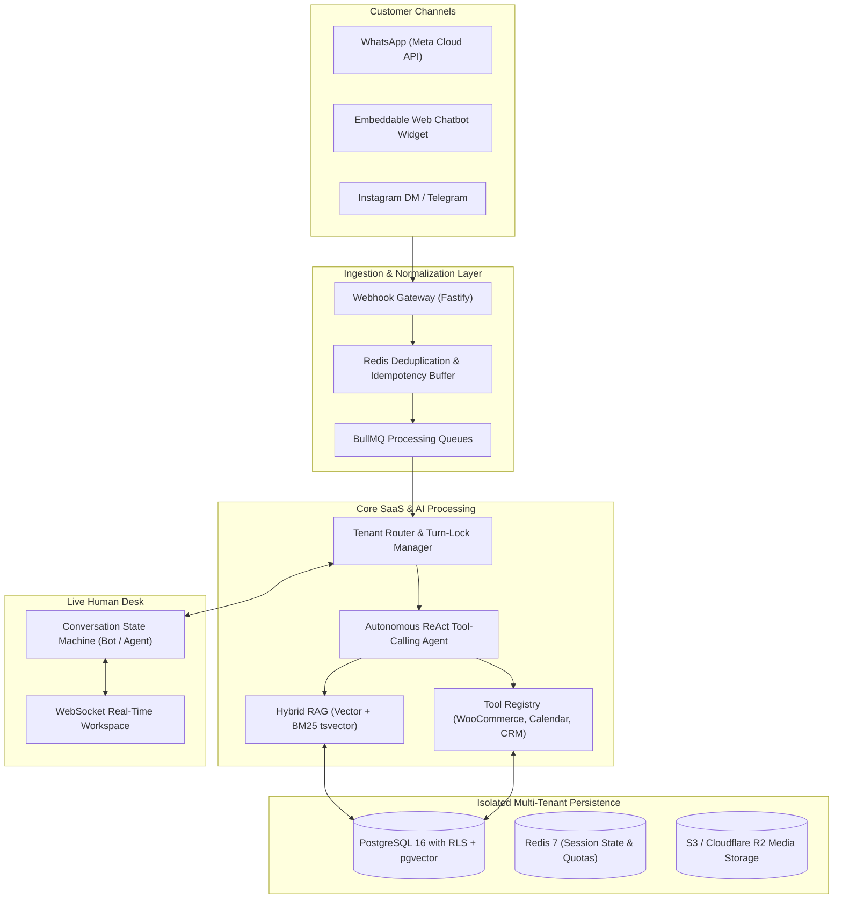

# Multi-Tenant AI WhatsApp & Omnichannel Chatbot SaaS Platform
## Production Engineering & Developer Agent Hand-off Repository

---

### Project Overview
This repository contains the complete technical architecture, data contracts, and step-by-step implementation blueprint for building a **Production-Grade Multi-Tenant AI Chatbot SaaS Platform**.

The platform is designed to serve businesses across multiple industries (Restaurants, Clinics, Salons, Real Estate, E-Commerce, Education, and Professional Services) with:
* **Omnichannel AI Chatbot:** WhatsApp (Meta Cloud API), Embeddable Web Chat Widget, Instagram DM, Telegram.
* **Core AI Agent Engine:** Autonomous tool-calling ReAct loop (Product Search, Booking, Order Tracking, CRM Lead Capture, Human Escalation).
* **Knowledge Base / Hybrid RAG:** Document ingestion (PDF, DOCX, TXT) and website crawler with PostgreSQL `pgvector` + BM25 hybrid search.
* **Business Integrations:** WooCommerce bi-directional product/order sync, native & Google Calendar / Cal.com booking engine.
* **Live Human Desk:** Real-time WebSocket inbox with conversation takeover, internal notes, and AI Copilot reply assistance.
* **Mini-CRM & Workflows:** Lead stage Kanban pipeline, custom attributes, timeline history, and trigger-condition-action automations.
* **SaaS Multi-Tenancy:** PostgreSQL Row-Level Security (RLS), Stripe subscription billing, Redis real-time quota metering, and industry blueprint presets.

---

## 📚 Agent Hand-off & Architecture Documentation Index

| Document | Purpose |
| :--- | :--- |
| 📖 **[AGENT_INSTRUCTIONS.md](file:///c:/Users/Administrator/Desktop/chat%20bot%20agent/AGENT_INSTRUCTIONS.md)** | **Engineering SOP & Guardrails:** Non-negotiable principles, multi-tenant isolation rules, async webhook guidelines, coding standards, and Definition of Done (DoD). |
| 📋 **[PHASE_ROADMAP_TASKS.md](file:///c:/Users/Administrator/Desktop/chat%20bot%20agent/PHASE_ROADMAP_TASKS.md)** | **Granular Implementation Tasks:** 8 Sequential Phases, 32 atomic tasks, target files, acceptance criteria, and verification commands. |
| 🔌 **[API_CONTRACTS.md](file:///c:/Users/Administrator/Desktop/chat%20bot%20agent/API_CONTRACTS.md)** | **Complete System Data Contracts:** Full PostgreSQL/Prisma RLS schema, normalized Inbound/Outbound TypeScript types, AI Tool JSON schemas, REST endpoints, and WebSocket events. |
| 🏛️ **[Master Technical Plan](file:///C:/Users/Administrator/.gemini/antigravity-ide/brain/fba9d184-426d-4509-b5aa-eda48684a580/master_architecture_and_implementation_plan.md)** | **System Strategy & Architecture:** High-level topology, component interaction diagrams, tech stack rationale, and security compliance guidelines. |

---

## High-Level System Architecture



---

## Planned Repository Structure

Once fully built across the 8 phases, the project follows this monorepo layout:

```
├── apps/
│   ├── api/                     # Backend Fastify/NestJS REST & WebSocket API
│   │   ├── src/
│   │   │   ├── modules/
│   │   │   │   ├── auth/        # JWT Authentication & RBAC
│   │   │   │   ├── channels/    # WhatsApp, WebChat, Telegram adapters
│   │   │   │   ├── ai/          # ReAct Agent orchestrator & LLM tools
│   │   │   │   ├── knowledge/   # PDF/DOCX parser & hybrid RAG engine
│   │   │   │   ├── integrations/# WooCommerce, Google Calendar, Cal.com
│   │   │   │   ├── conversations/# Conversation state machine & Live Desk
│   │   │   │   ├── crm/         # Contacts, custom attributes & pipeline
│   │   │   │   ├── automations/ # Trigger-condition-action workflow engine
│   │   │   │   └── billing/     # Stripe subscriptions & Redis quota guard
│   │   │   ├── queues/          # BullMQ queue workers & producers
│   │   │   └── main.ts
│   │   └── test/                # Unit and E2E integration test suites
│   ├── web-dashboard/           # Next.js 14+ Tenant & Super-Admin Portal
│   │   └── src/
│   │       ├── app/             # App router pages (Live Desk, CRM, RAG, Analytics)
│   │       └── components/      # UI components (Shadcn UI, Tailwind)
│   └── chat-widget/             # Lightweight embeddable vanilla JS/TS widget
├── packages/
│   ├── database/                # Prisma ORM schemas, RLS migrations & seeders
│   └── shared-types/            # Shared TypeScript interfaces & industry blueprints
├── docker/                      # Multi-stage production Dockerfiles
├── docs/                        # Setup guides, WhatsApp Cloud API setup, WooCommerce
├── AGENT_INSTRUCTIONS.md        # SOP for implementing agents
├── API_CONTRACTS.md             # Complete data contracts & tool schemas
├── PHASE_ROADMAP_TASKS.md       # 8-phase task execution checklist
└── README.md
```

---

## Execution Guide for Development Agents

To begin development, start with **Phase 1, Task 1.1** in [PHASE_ROADMAP_TASKS.md](file:///c:/Users/Administrator/Desktop/chat%20bot%20agent/PHASE_ROADMAP_TASKS.md):

1. **Read Guidelines:** Review [AGENT_INSTRUCTIONS.md](file:///c:/Users/Administrator/Desktop/chat%20bot%20agent/AGENT_INSTRUCTIONS.md) for coding standards, RLS security rules, and Definition of Done.
2. **Review Interfaces:** Consult [API_CONTRACTS.md](file:///c:/Users/Administrator/Desktop/chat%20bot%20agent/API_CONTRACTS.md) for data schemas and tool declarations.
3. **Execute Task by Task:** Follow the sequential tasks in `PHASE_ROADMAP_TASKS.md`, verify tests, and mark tasks `[x]` as completed.
